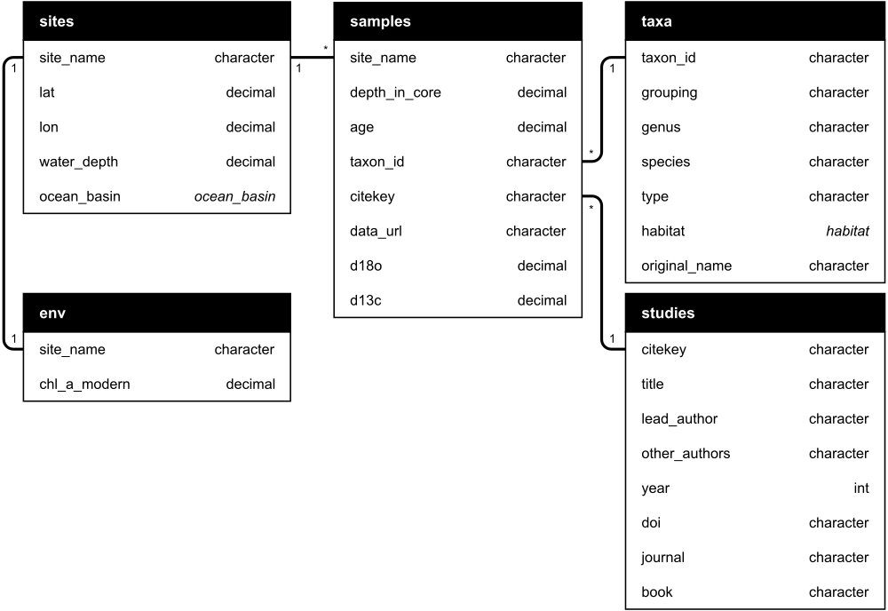
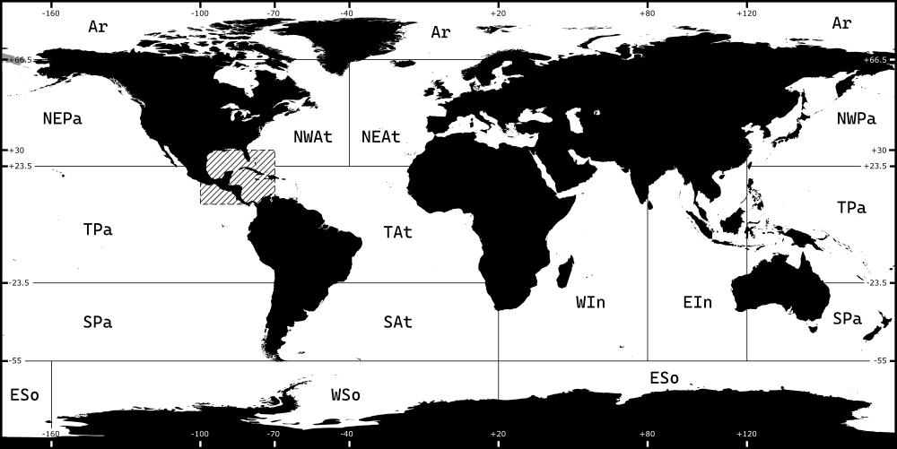

# Data structure

Data is presented in four tab-delimited files each corresponding to a table in a simple relational-style “database”:



Further explanation of each table can be found in the following sections, and a [schema](./schema.dbml) (in [DBML](https://www.dbml.org/home/) format, the source of the diagram above) is also available.

**Attribute List**

* [**Sites**](#sites)
    * [Site name](#site-name)
    * [Latitude and longitude](#latitude-and-longitude)
    * [Water depth](#water-depth)
    * [Ocean basin](#ocean-basin)
* [**Samples**](#samples)
    * [Site name](#site-name-)
    * [Depth in core](#depth-in-core)
    * [Age](#age)
    * [Taxon ID](#taxon-id-)
    * [Citekey](#citekey-)
    * [Data URL](#data-url)
    * [&delta;<sup>18</sup>O](#δ18o)
    * [&delta;<sup>13</sup>C](#δ13C)
* [**Taxa**](#taxa)
    * [Taxon ID](#taxon-id)
    * [Grouping](#grouping)
    * [Genus, species, type](#genus-species-type)
    * [Habitat](#habitat)
    * [Original name](#original-name)
* [**Studies**](#studies)
    * [Citekey](#citekey)
    * [Title](#title)
    * [Lead author, other authors](#lead-author-other-authors)
    * [Year](#year)
    * [DOI](#doi)
    * [Journal](#journal)
    * [Book](#book)
* [**Env**](#env)
    * [Site name](#site-name-)
    * [Modern surface chlorophyll](#modern-surface-chlorophyll)

---

## Sites

### Site name

```
name  sites.site_name
type  character
```

The (locally unique) identifier used by the science team which took the core. Normalised to alphanumeric characters and underscores (e.g. `PO200/10_8-2.97` becomes `PO200_10_8_2_97`)

### Latitude and longitude

```
name  sites.lat
type  decimal
```

```
name  sites.lon
type  decimal
```

`lat` and `lon` are given in decimal degrees using negative numbers for the western and southern hemispheres (i.e. the international date line is at ±180°).

### Water depth

```
name  sites.water_depth
type  integer
```

Depth below mean sea level, to the nearest **meter**, of the seabed at the cored location.

### Ocean basin

```
name  sites.ocean_basin
type  ocean_basin (enum)
```



Populated approximately according to the definitions of the International Association for the Physical Sciences of the Oceans ([PDF](http://iapso.iugg.org/images/stories/pdf/IAPSO_publications/Publications_Scientifiques/Pub_Sci_No_35.pdf)), with additional bounds defined where implied in the original:

| Code   | Description              | North |  East  | South |  West  |
| ------ | ------------------------ | -----:| ------:| -----:| ------:|
| `NEAt` | Northeast Atlantic Ocean |  66.5 |   20.0 |  23.5 |  -40.0 |
| `Med`  | Mediterranean Sea        |  48.0 |   45.0 |  30.0 |   -5.8 |
| `NWAt` | Northwest Atlantic Ocean |  66.5 |  -40.0 |  23.5 | -100.0 |
| `TAt`  | Tropical Atlantic Ocean  |  23.5 |   20.0 | -23.5 |  -70.0 |
| `SAt`  | South Atlantic Ocean     | -23.5 |   20.0 | -55.0 |  -70.0 |
| `NEPa` | Northeast Pacific Ocean  |  66.5 | -100.0 |  23.5 | -180.0 |
| `NWPa` | Northwest Pacific Ocean  |  66.5 |  180.0 |  23.5 |  120.0 |
| `TPa`  | Tropical Pacific Ocean   |  23.5 |  -70.0 | -23.5 |  120.0 |
| `SPa`  | South Pacific Ocean      | -23.5 |  -70.0 | -55.0 |  120.0 |
| `EIn`  | Eastern Indian Ocean     |  30.0 |  120.0 | -55.0 |   80.0 |
| `WIn`  | Western Indian Ocean     |  30.0 |   80.0 | -55.0 |   20.0 |
| `ESo`  | Eastern Southern Ocean   | -55.0 | -160.0 | -90.0 |   20.0 |
| `WSo`  | Western Southern Ocean   | -55.0 |   20.0 | -90.0 | -160.0 |
| `Ar`   | Arctic Ocean             |  90.0 |  180.0 |  66.5 | -180.0 |

**Notes**:

* The bounding latitude and longitude values above create simple rectangular boxes and do not take into account coastlines. The hatched area in the figure above shows where these boxes are ambiguous or wrong, and care should be taken in these areas
* The Mediterranean and Black Seas are a special case since their oceanographic conditions are quite different from the Northeast Atlantic. Both are categorised as `Med`, the western boundary of which is taken as the Kamara Ridge, the shallowest part of the Straits of Gibraltar (see Figure 1 in [de Stephanis *et al.*, 2008](https://doi.org/10.3354/meps07164)). The boundaries in the above table include the Bay of Biscay but in the compilation code, this is avoided by using two boxes.
* The other major seas are included in their parent ocean:
    - Caribbean Sea: Tropical Atlantic (`TAt`)
    - Gulf of Mexico: NW Atlantic (`NWAt`)
    - Hudson Bay: Arctic (`Ar`)
* `lat` and `lon` can always be used to filter sites of interest from ambiguous areas.
* North and west bounds are inclusive, and east and south are exclusive - for example, the arctic ocean is defined as:

```R
  90 >= lat > 66.5;
-180 <= lon < 180;
```

---

## Samples

### Site name ☍

```
name        samples.site_name
type        character
constraint  foreign key
```

The same as [Sites: Site name](#site-name) and the value for a record in this table must be present in the `sites` table (i.e. it is a foreign key, ☍).

### Depth in core

```
name  samples.depth_in_core
type  decimal
```

The depth down-core of the sample, in **meters**.

### Age

```
name  samples.age
type  decimal
```

The age of the sample, in thousands of years before present (**kyr BP**), according to the age model of the study in which the sample was published (denoted by the `citekey` attribute).

### Taxon ID ☍

```
name        samples.taxon_id
type        integer
constraint  foreign key
```

A link to the relevant record in the `taxa` table. *See* [Taxa: Taxon ID](#taxon-id)

### Citekey ☍

```
name        samples.citekey
type        character
constraint  foreign key
```

A link to the relevant record in the `studies` table. If the data was used in more than one publication according to [Jonkers et al. (2020)](https://doi.org/10.5194/essd-12-1053-2020), this refers to the first study mentioned. *See* [Studies: Citekey](#citekey)

### Data URL

```
name  samples.data_url
type  character
```
URL of the data, if available.

### &delta;<sup>18</sup>O

```
name  samples.d18o
type  decimal
```

The &delta;<sup>18</sup>O measurement of the calcite of the `taxon_id` in this `age` interval.

### &delta;<sup>13</sup>C

```
name  samples.d13c
type  decimal
```

The &delta;<sup>13</sup>C measurement of the calcite of the `taxon_id` in this `age` interval.

---

## Taxa

### Taxon ID

```
name        taxa.taxon_id
type        character
constraint  primary key
```

A locally unique code,  composed of a contraction of the genus name for taxa specified to genus level, and the first letter of the genus with a contraction of the species name, separated by an underscore, for a taxon defined to species level. With or without a modifier for morphotypes etc. (see `taxa.type`). For example, *Globigerinoides ruber* (pink) has the taxon ID `G_ruber_p`. *See also*: [Genus, species, type](#genus-species-type)

### Grouping

```
name  taxa.grouping
type  character
```

A functional grouping of similar taxa, or a grouping of taxa which were not identified to Genus or species level (for example, “various benthics”).

### Genus, species, type

```
name  taxa.genus
type  character
```

```
name  taxa.species
type  character
```

```
name  taxa.type
type  character
```

The accepted binomial name of the taxon, according to the World Register of Marine Species. `taxa.species` may be empty if the species is uncertain or various, and the `taxa.type` field allows morphotypes, chromotypes, and so on:

| Taxon ID     | Genus           | Species | Type | Example textual style  |
| ------------ | --------------- | ------- | ---- | ---------------------- |
| `Globigrnds` | Globigerinoides |         |      | *Globigerinoides* spp. |
| `G_ruber`    | Globigerinoides | ruber   |      | *G. ruber*             |
| `G_ruber_p`  | Globigerinoides | ruber   | pink | *G. ruber* (pink)      |

### Habitat

```
name  taxa.habitat
type  habitat (enum)
```

A code describing the general habitat of the foraminiferal species:

| Code | Description |
| ---- | ----------- |
| `Bn` | Benthic     |
| `Pl` | Planktic    |

### Original name

```
name  taxa.original_name
type  habitat (enum)
```

The species name as reported in the original, if different from the values in the other attributes in this table. Names may have been changed because taxa have been redefined since the original (e.g. *G. sacculifer* to *T. sacculifer*) or because they were synonyms of a taxon already present in the table (e.g. *N. pachyderma* sinistralis and *N. pachyderma* (left)).

---

## Studies

All studies referenced in the dataset are also listed in the bibTeX file [`/docs/references.bib`](/docs/references.bib) for easy import into reference managers.
### Citekey

```
name        studies.citekey
type        character
constraint  primary key
```

A locally unique ID based on the [JabRef key patterns](https://docs.jabref.org/setup/bibtexkeypatterns#key-patterns) in the form `[auth.etal:lower][year]`.

### Title

```
name  studies.title
type  character
```

### Lead author, other authors

```
name  studies.lead_author
type  character
```

```
name  studies.other_authors
type  character
```
The names of the authors of the study in the format `family_name, first_initial. [prefix]` (e.g. "Einstein, A." or "Humboldt,  A. von"). Other authors are separated by a semicolon and a space.

### Year

```
name  studies.year
type  integer
```

The publication year for the original study.

### DOI

```
name  studies.doi
type  character
```

The [Digital Object Identifier](https://doi.org) of the study. Resolved at `https://doi.org/<doi>` where `<doi>` is the value of this field.

### Journal

```
name  studies.journal
type  character
```

The title (name) of the Journal in which the paper was published (if applicable).

### Book

```
name  studies.book
type  character
```

The title of the book in which the section or chapter was published (if applicable).

---

## Env

This table contains modern (and eventually palaeo-) environmental data for each site listed in the [sites table](#sites), useful for filtering the sites to include in any analyses.

### Site name ☍

```
name        env.site_name
type        character
constraint  foreign key
```

Cross-reference to [Sites: Site name](#site-name).

### Modern surface chlorophyll


```
name  env.chl_a_modern
type  decimal
```

The modern surface chlorophyll-a value for the 1-degree pixel in which the site is located, derived from the [MODIS Aqua](https://dx.doi.org/10.5067/AQUA/MODIS/L3M/CHL/2018) [entire mission composite](https://oceandata.sci.gsfc.nasa.gov/MODIS-Aqua/Mapped/Cumulative/9km/chl_ocx/), [2002-2020](https://oceandata.sci.gsfc.nasa.gov/ob/getfile/A20021852020121.L3m_CU_CHL_chl_ocx_9km.nc)
